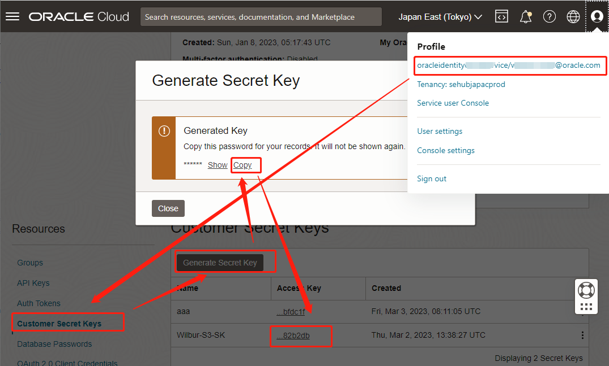

# C++用S3 SDK 读写 OCI Buckets

## 准备工作

##### Step 1. 准备虚拟机

 VM OS: Centos 7

##### Step 2. 准备S3密钥

准备Customer Key:



把下面2行放到 ~/.bash_profile的末尾：

```shell
export AWS_ACCESS_KEY_ID=<上图的Access Key>
export AWS_SECRET_ACCESS_KEY=<上图的ASecret Key>
```

应用环境变量

```shell
source ~/.bash_profile
```

## 安装环境

```shell
sudo su
setenforce 0 
sed -i 's/SELINUX=enforcing/SELINUX=disabled/g' /etc/sysconfig/selinux
sed -i 's/SELINUX=enforcing/SELINUX=disabled/g' /etc/selinux/config
systemctl disable firewalld
systemctl stop firewalld

yum install -y  git gcc gcc-c++ make automake libcurl-devel openssl-devel libuuid-devel pulseaudio-libs-devel

su opc
mkdir ~/c++/
cd ~/c++/
wget https://cmake.org/files/v3.21/cmake-3.21.0.tar.gz
tar xzvf cmake-3.21.0.tar.gz
cd cmake-3.21.0
./bootstrap && make && sudo make install

```

##### Step 2. 编译AWS SDK

```shell
cd ~/c++
git clone --recurse-submodules https://github.com/aws/aws-sdk-cpp
mkdir sdk_build
cd sdk_build
cmake ../aws-sdk-cpp -DCMAKE_BUILD_TYPE=Debug -DCMAKE_PREFIX_PATH=/usr/local/ -DCMAKE_INSTALL_PREFIX=/usr/local/ -DBUILD_SHARED_LIBS=on -DBUILD_ONLY="s3" -DENABLE_TESTING=OFF

make && sudo make install
```

##### Step 3. 编写测试程序

```shell
mkdir ~/c++/test
cd ~/c++/test
vim test.cpp
```

编写 test.cpp

```c++
#include <iostream>
#include <fstream>
#include <sys/stat.h>
#include <aws/core/Aws.h>
#include <aws/s3/S3Client.h>
#include <aws/s3/model/PutObjectRequest.h>
#include <aws/s3/model/GetObjectRequest.h>
using namespace std;

const Aws::String ORACLE_REGION = "ap-tokyo-1";
const Aws::String ORACLE_NAMESPACE = "sehubjapacprod";
const Aws::String ORACLE_BUCKET = "Wilbur-Bucket";

Aws::S3::S3Client getS3Client(){
    Aws::String endpoint = "https://" + ORACLE_NAMESPACE + ".compat.objectstorage." + ORACLE_REGION + ".oraclecloud.com/" + ORACLE_BUCKET + "/";
    
    Aws::Client::ClientConfiguration clientConfig;
    clientConfig.verifySSL = false;
    clientConfig.region = ORACLE_REGION;
    clientConfig.endpointOverride = endpoint;
    
    Aws::S3::S3Client s3_client(clientConfig, Aws::Client::AWSAuthV4Signer::PayloadSigningPolicy::Never, false);
    return s3_client;
}

void uploadFile(Aws::S3::S3Client &s3, const Aws::String &keyName, const Aws::String &sourceFile){
    Aws::S3::Model::PutObjectRequest request;
    request.SetBucket(ORACLE_BUCKET);
    request.SetKey(keyName);

    std::shared_ptr<Aws::IOStream> inputData =
        Aws::MakeShared<Aws::FStream>("SampleAllocationTag",
        sourceFile.c_str(),
        std::ios_base::in | std::ios_base::binary);

    if (!*inputData) {
        std::cerr << "Error unable to read file " << sourceFile << std::endl;
        return ;
    }
    request.SetBody(inputData);

    Aws::S3::Model::PutObjectOutcome outcome = s3.PutObject(request);

    if (!outcome.IsSuccess()) {
        std::cerr << "Error: PutObject: " <<
                  outcome.GetError().GetMessage() << std::endl;
    }
    else {
        std::cout << "Added object '" << sourceFile << "' to bucket '" << ORACLE_BUCKET << "'." << std::endl;
    }
}

void downloadFile(Aws::S3::S3Client &s3, const Aws::String &keyName, const Aws::String &destFile){
    Aws::S3::Model::GetObjectRequest request;
    request.SetBucket(ORACLE_BUCKET);
    request.SetKey(keyName);

    Aws::S3::Model::GetObjectOutcome outcome = s3.GetObject(request);

    if (!outcome.IsSuccess()) {
        const Aws::S3::S3Error &err = outcome.GetError();
        std::cerr << "Error: GetObject: " <<
                  err.GetExceptionName() << ": " << err.GetMessage() << std::endl;
    }
    else {
        std::cout << "Successfully retrieved '" << keyName << "' from '" << ORACLE_BUCKET << "'." << std::endl;
        std::ofstream outFile;
        outFile.open(destFile);
        outFile << outcome.GetResult().GetBody().rdbuf();
        outFile.close();
    }

    std::cout << "Added object '" << destFile;
}

int main(){
    Aws::SDKOptions options;
    options.loggingOptions.logLevel = Aws::Utils::Logging::LogLevel::Debug;
    Aws::InitAPI(options);
    {
        Aws::S3::S3Client s3 = getS3Client();
        uploadFile(s3, "a5.txt","a1.txt");
        downloadFile(s3, "a5.txt","a5_down1.txt");
    }
    Aws::ShutdownAPI(options);
    return 0;
}

```


## 编译与测试

```shell
vi CMakeLists.txt
```

写入

```c++
cmake_minimum_required(VERSION 3.3)
set(CMAKE_CXX_STANDARD 11)
project(test LANGUAGES CXX)

message(STATUS "CMAKE_PREFIX_PATH: ${CMAKE_PREFIX_PATH}")
set(BUILD_SHARED_LIBS ON CACHE STRING "Link to shared libraries by default.")

#Load required services/packages: This basic example uses S3.
find_package(AWSSDK REQUIRED COMPONENTS s3)
add_executable(${PROJECT_NAME} "test.cpp") 

set_compiler_flags(${PROJECT_NAME})
set_compiler_warnings(${PROJECT_NAME})
target_link_libraries(${PROJECT_NAME} ${AWSSDK_LINK_LIBRARIES})
```

编译与测试

```shell
cmake ./
make
./test
```

