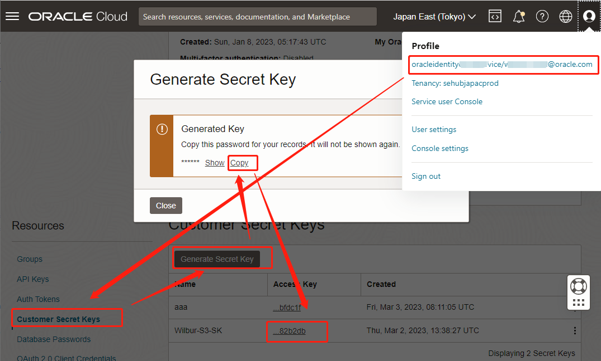

# PHP 用S3 SDK 读写 OCI Buckets

## 准备工作

### Step 1. 准备虚拟机

 VM OS: Centos 7

### Step 2. 准备S3密钥

准备Customer Key:



把下面2行放到 ~/.bash_profile的末尾：

```shell
export AWS_ACCESS_KEY_ID=<上图的Access Key>
export AWS_SECRET_ACCESS_KEY=<上图的ASecret Key>
```

应用环境变量

```shell
source ~/.bash_profile
```

## 安装环境

```shell
sudo su
setenforce 0 
sed -i 's/SELINUX=enforcing/SELINUX=disabled/g' /etc/sysconfig/selinux
sed -i 's/SELINUX=enforcing/SELINUX=disabled/g' /etc/selinux/config
systemctl disable firewalld
systemctl stop firewalld

yum -y install https://dl.fedoraproject.org/pub/epel/epel-release-latest-7.noarch.rpm
yum -y install https://rpms.remirepo.net/enterprise/remi-release-7.rpm
yum -y install yum-utils -y
yum-config-manager --enable remi-php74
yum -y install php php-cli php-mysqlnd php-zip php-gd php-mcrypt php-mbstring php-xml php-json php-opcache php-bcmath php-soap php-pear-Net-Socket php-intl
yum -y install certbot mod_ssl

cd /usr/local/bin
wget https://getcomposer.org/composer-1.phar -O composer
chmod +x compose

su opc
mkdir ~/php/
cd ~/php/
composer require aws/aws-sdk-php

vim test.php
```

输入以下内容：

```php
<?php
require 'vendor/autoload.php';

use Aws\S3\S3Client;
use Aws\S3\Exception\S3Exception;


//define('ORACLE_ACCESS_KEY', '****'); //用环境变量AWS_ACCESS_KEY_ID代替
//define('ORACLE_SECRET_KEY', '***');//用环境变量AWS_SECRET_ACCESS_KEY代替
define('ORACLE_REGION', 'ap-tokyo-1');
define('ORACLE_NAMESPACE', 'sehubjapacprod');
define('ORACLE_BUCKET', 'Wilbur-Bucket');
       
function getS3Client(){
    $endpoint = "https://".ORACLE_NAMESPACE.".compat.objectstorage.".ORACLE_REGION.".oraclecloud.com/".ORACLE_BUCKET."/";
    $s3 = new S3Client(array(
        /*用环境变量代替
        'credentials' => [
            'key' => ORACLE_ACCESS_KEY,
            'secret' => ORACLE_SECRET_KEY,
        ],
        */
        'version' => 'latest',
        'region' => ORACLE_REGION,
        'signature_version' => 'v4',
        'use_path_style_endpoint' => true,
        'bucket_endpoint' => true,
        'endpoint' => $endpoint
    ));
    return $s3;
}

function uploadFile($s3, $keyName, $sourceFile){
    try {
        $objs = [
            'Bucket' => ORACLE_BUCKET,
            'Key'    => $keyName,
            'SourceFile' => $sourceFile
        ];

        //print_r($objs);
        $result = $s3->putObject($objs);
        //print_r($result);

        echo 'Uploaded. Object URL：' .$result['ObjectURL'] . PHP_EOL;
    } catch (S3Exception $e) {
        echo $e->getMessage() . PHP_EOL;
    }
}

function downloadFile($s3, $keyName, $destFile){
    try {
        $objs = [
            'Bucket' => ORACLE_BUCKET,
            'Key'    => $keyName,
        ];

        //print_r($objs);
        $result = $s3->getObject($objs);
        //print_r($result);

        $body = $result['Body']; 
        echo 'Downloaded. File content:'.$body. PHP_EOL;
        
        // 二进制流文件 $inflatedBody = new InflateStream($result['Body']); 

        $text_file = fopen($destFile, "w+");
        fwrite($text_file, $body);
        fclose($text_file);

    } catch (S3Exception $e) {
        echo $e->getMessage() . PHP_EOL;
    }
}

$s3 = getS3Client();
uploadFile($s3, "a4.txt","a1.txt");
downloadFile($s3, "a4.txt","a4_down1.txt");
```

## 测试

```shell
echo 2223 > a1.txt
php test.php
cat a4_down1.txt
```
